# 🤖 ResumeIQ — AI-Powered Resume Analyzer

## 📌 Overview

**ResumeIQ** is an AI-powered resume analysis platform that helps job seekers improve their resumes by analyzing skills, extracting important information, matching job descriptions, and providing intelligent feedback.

The system uses **Artificial Intelligence and Natural Language Processing (NLP)** techniques to evaluate resumes and generate meaningful insights.

# 📸 Screenshots

## 🏠 Home Page
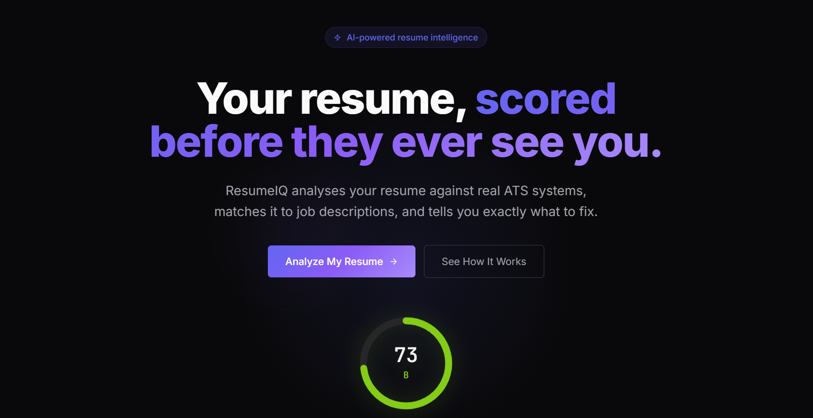

## 📊 Dashboard
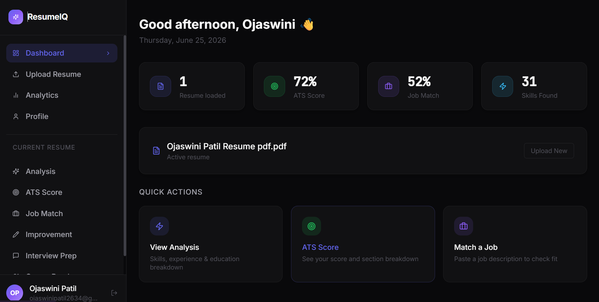

## 📄 Resume Upload
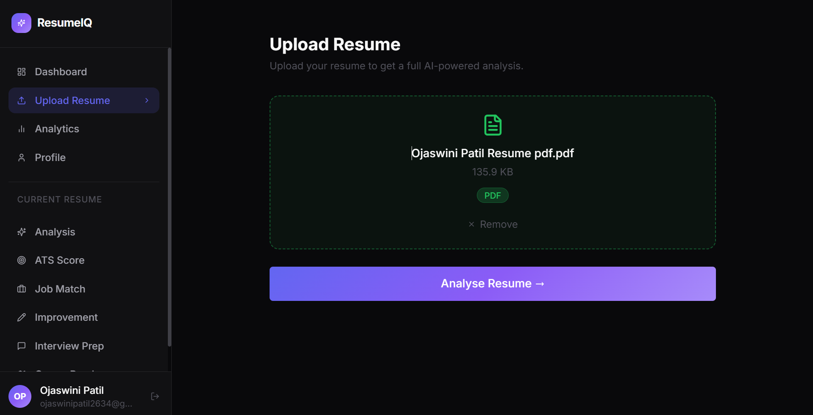

## 🔍 Resume Analysis
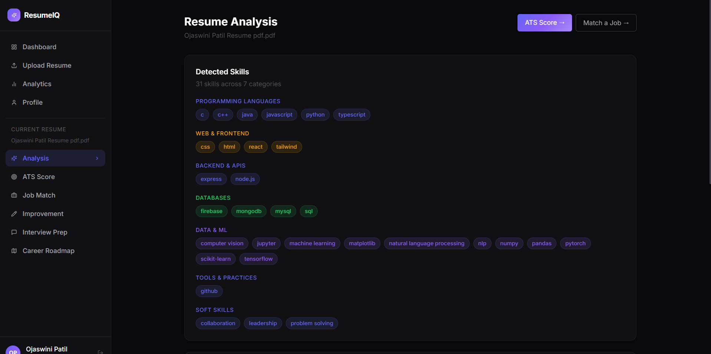

## 🎯 ATS Score

## 💼 Job Match
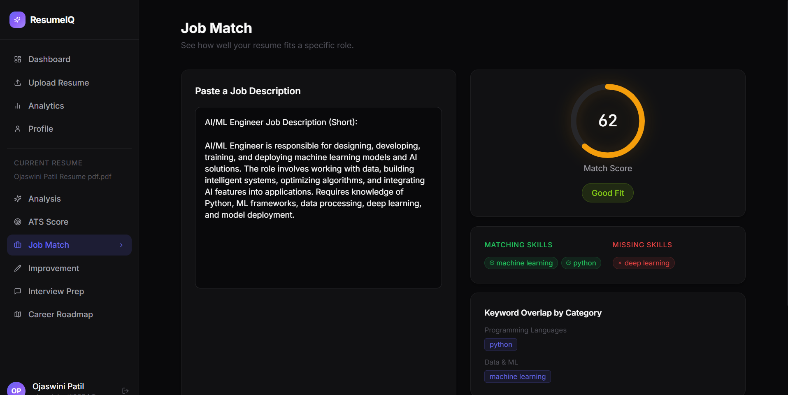

## 📈 Analytics
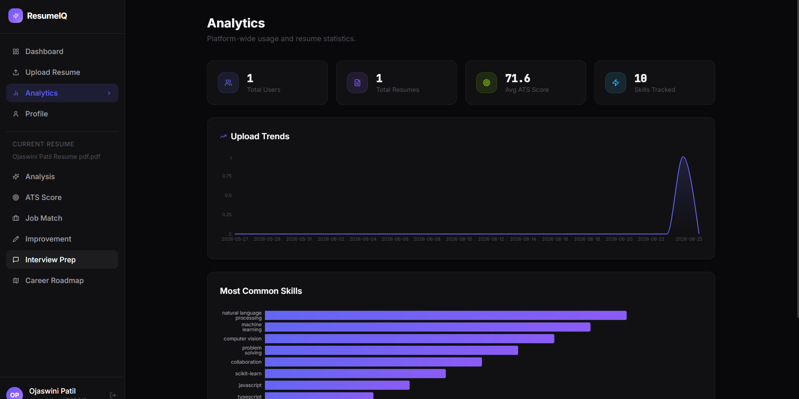

## 📝 Resume Improvement Suggestions
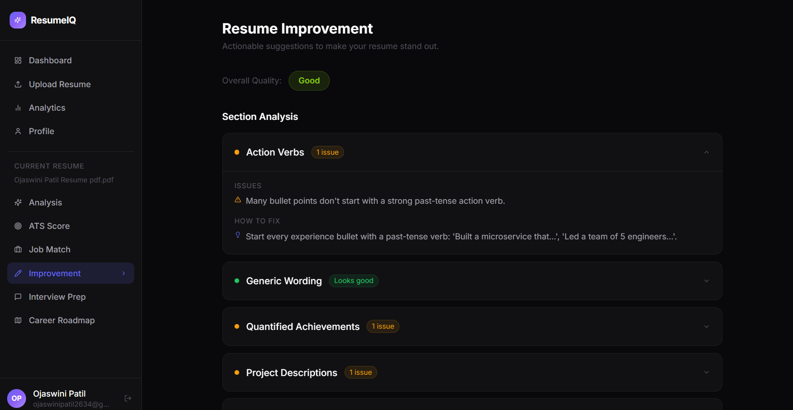

## 🧑‍💻 Profile
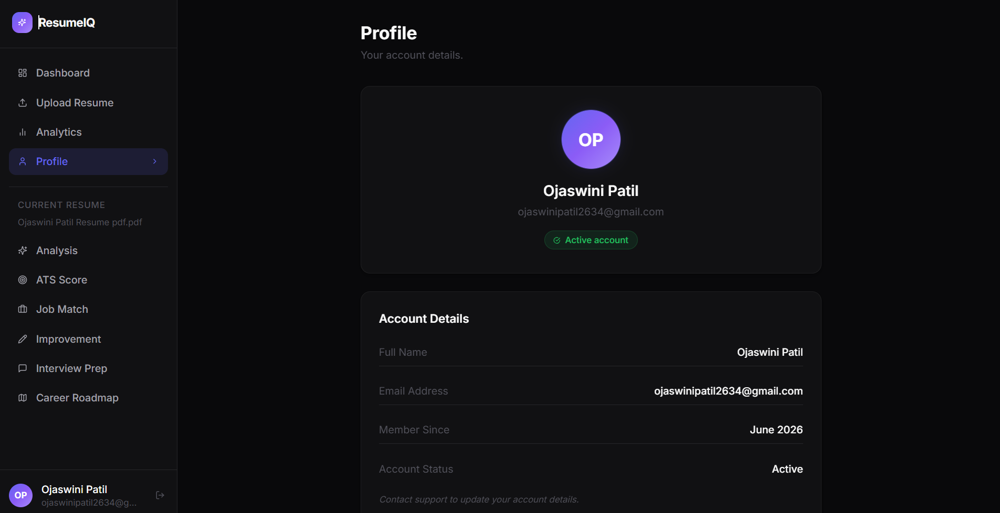

## 🎤 Interview Preparation
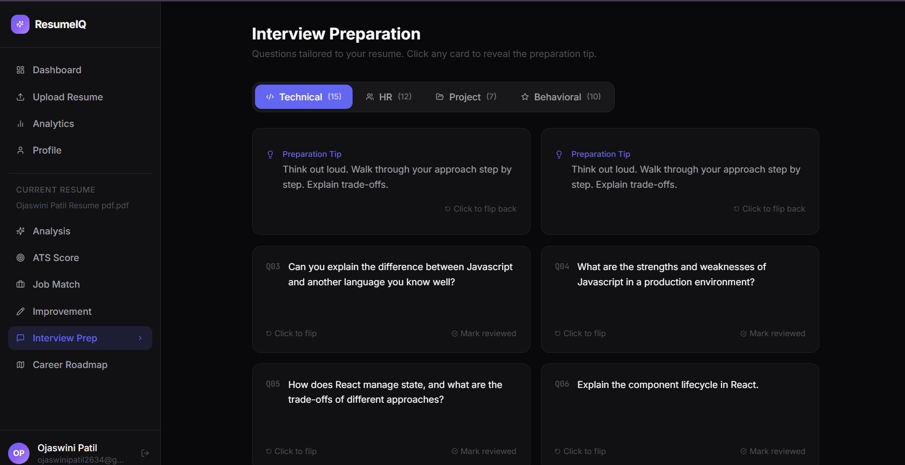

## 🗺 Career Roadmap
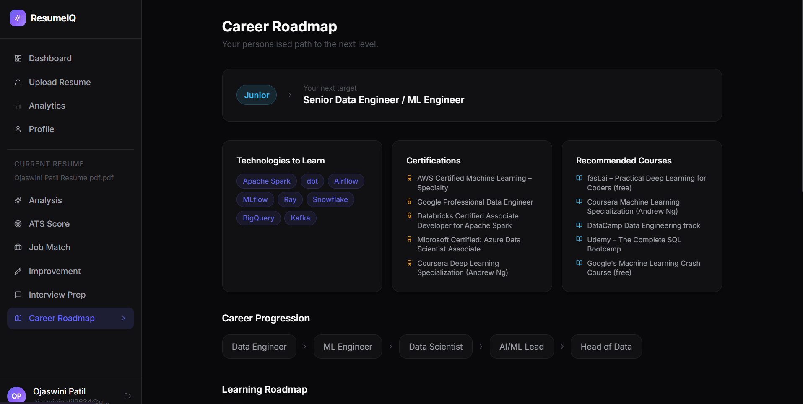

## 🔐 Register Page
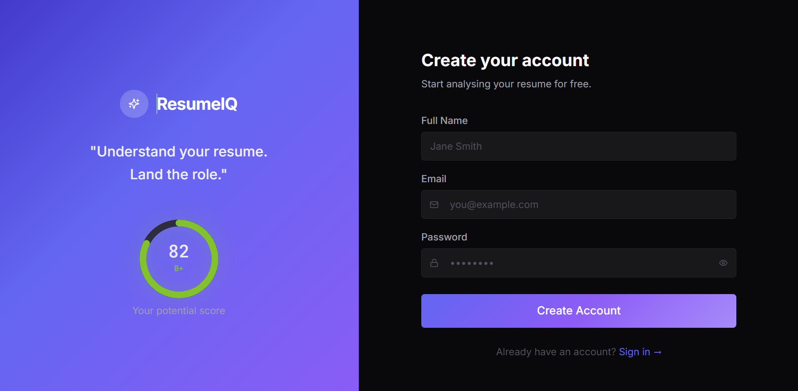

## 🚀 Features

✅ Upload resume (PDF/DOCX)  
✅ AI-based resume parsing  
✅ Extracts skills, education, and experience  
✅ Resume quality scoring  
✅ Job description matching  
✅ Skill gap analysis  
✅ AI-generated improvement suggestions  
✅ User authentication  
✅ Modern responsive interface  

---
